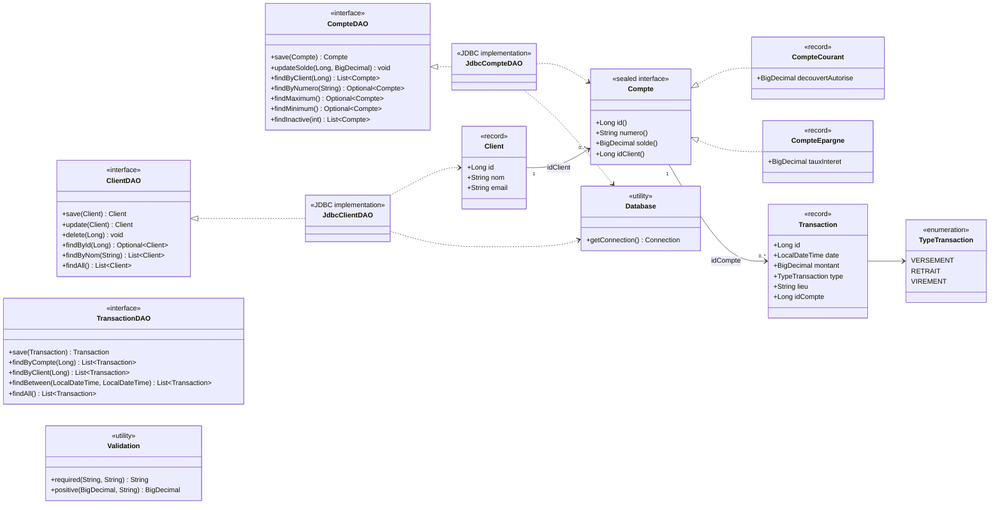

# Analyse des transactions

Application Java de gestion et d'analyse de comptes bancaires avec PostgreSQL.

## Fonctionnalités

- Gestion des clients.
- Gestion des comptes courants et comptes d'épargne.
- Mise à jour des soldes.
- Recherche de comptes par client ou numéro.
- Recherche des comptes avec le solde maximum ou minimum.
- Détection des comptes inactifs.
- Gestion des transactions bancaires.

## Prérequis

- Java 25 LTS.
- Maven 3.9 ou supérieur.
- PostgreSQL.

## Configuration de la base de données

Créez une base nommée `analyse_transactions`, puis exécutez le schéma :

```bash
psql -U postgres -d analyse_transactions -f src/main/resources/schema.sql
```

La connexion utilise par défaut :

- URL : `jdbc:postgresql://localhost:5432/analyse_transactions`
- Utilisateur : `postgres`
- Mot de passe : `postgres`

Ces valeurs peuvent être remplacées avec les variables d'environnement suivantes :

```text
DB_URL=jdbc:postgresql://localhost:5432/analyse_transactions
DB_USER=postgres
DB_PASSWORD=postgres
```

## Compilation et tests

```bash
mvn clean test
```

Pour compiler uniquement le projet et les tests :

```bash
mvn clean test-compile
```

## Exécution

Le `pom.xml` configure `ma.albaraka.ui.Main` comme classe principale :

```bash
mvn exec:java
```

La classe `ma.albaraka.ui.Main` doit être présente dans le projet pour exécuter cette commande. Le code métier et l'accès aux données se trouvent sous `src/main/java/ma/albaraka`.

## Structure

```text
src/main/java/ma/albaraka/
├── dao/       Interfaces et implémentations JDBC
├── entity/    Modèle métier des clients, comptes et transactions
└── util/      Connexion à la base et validations
```

## Class diagram



## Dépendances principales

- PostgreSQL JDBC `42.7.12`
- Maven Compiler Plugin `3.14.1`
- Maven Surefire Plugin `3.5.3`
